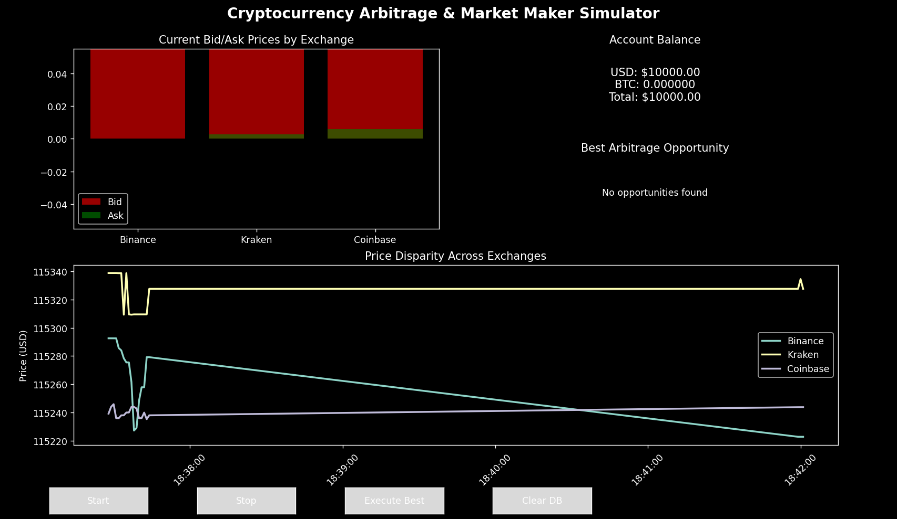
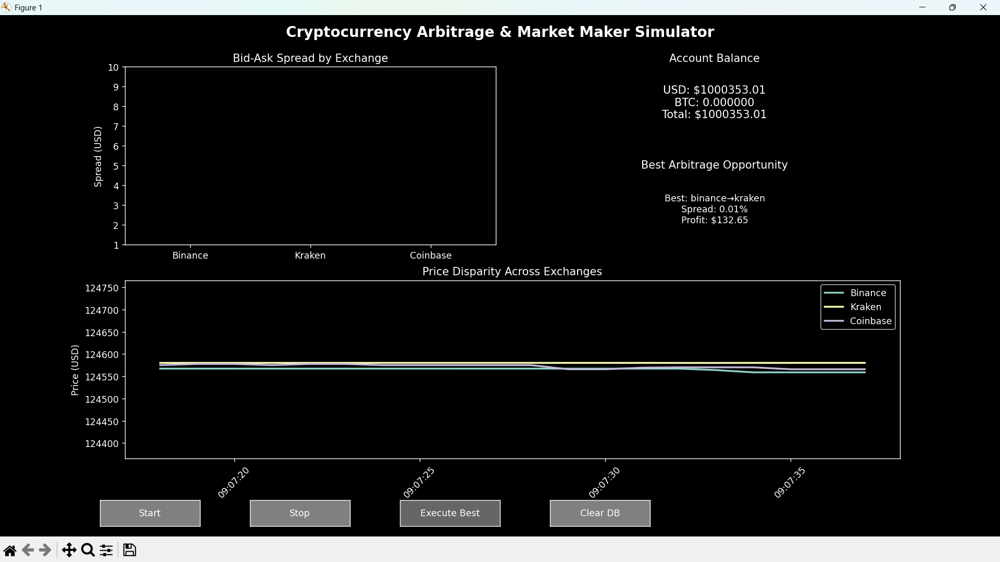

# Cryptocurrency Arbitrage Simulator

Real-time arbitrage detection across multiple crypto exchanges with live visualization.

*Real-time arbitrage detection across exchanges*

*Profit tracking with trading fees included*

## Features
- Real-time price monitoring via WebSocket APIs
- Multi-exchange arbitrage detection (Binance, Kraken, Coinbase)
- Live profit calculation with trading fees(optional)
- Interactive matplotlib visualization
- SQLite database for opportunity tracking

## Tech Stack
- Python 3.11+, asyncio, aiohttp
- Matplotlib for real-time visualization
- SQLite for data persistence
- WebSocket APIs + REST fallback

## Limitations
- Slow and lags
- Delayed BTC data from exchanges

## To Run
- Simply do `python main.py`

## Errors
- There is some display error in bars which I tried to solve in main2.py, main3.py but failed.
